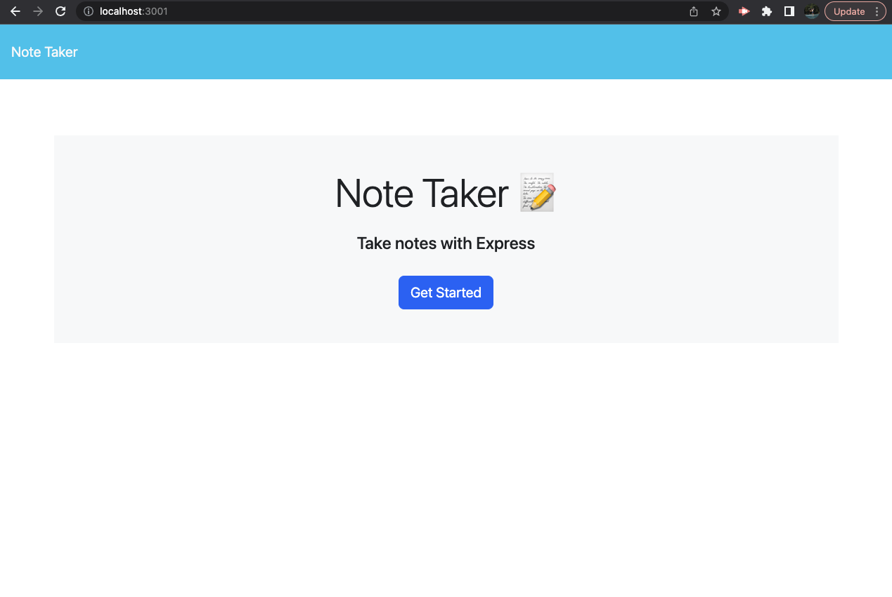
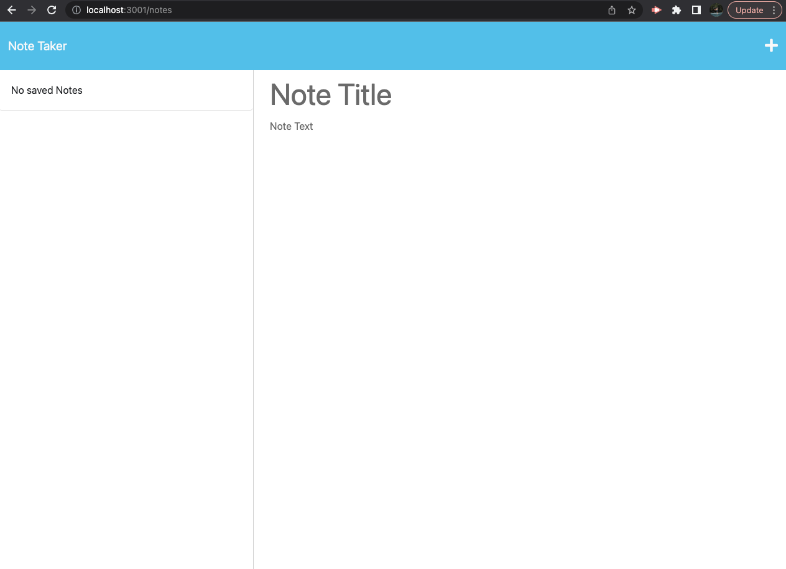
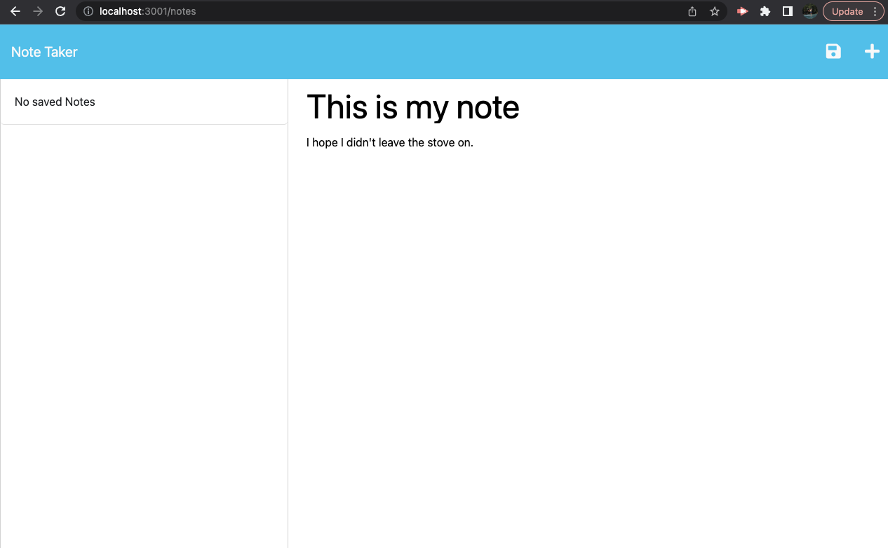
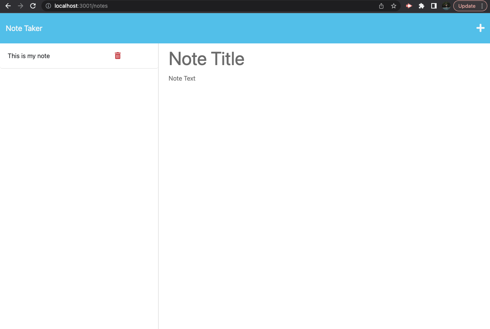

# Jacobs-Note-Taker

## Table-of-Contents

- [Description](#description)
- [Installation](#installation)
- [Usage](#usage)

- [License](#license)
- [Contributing](#contributing)
- [Questions](#questions)

## [Description](#table-of-contents)

This note taker will make taking notes for your classes or everyday life a cake walk. Need a grocery list? Done. Need to take some notes for your significant other to remember? Done! This note taker makes everyday notes a breeze.

To make my own notes more organized as well as help others with their notes as well!

## [Installation](#table-of-contents)

To run this project Clone the repo onto your local computer, then you'll want to open an integrated terminal to the server.js file.

## [Usage](#table-of-contents)

After doing this run the command `npm i && npm start`. This will host a local server for you to run your notes on. To visit this local server go to `localhost:3001` now that you have the note taker on your local host. Click `Get Started` and watch your notes explode into life!

![ref]

[ref]: images

## [License](#table-of-contents)

The application is covered under the following license:

[mit](https://choosealicense.com/licenses/mit)

## [Contributing](#table-of-contents)

Thank you for your interest in helping to improve the project! However, I will not be accepting contributions from anyone else.

## [Questions](#table-of-contents)

Please contact me using the following links:

[GitHub](https://github.com/jacobgoreham)

[Email: jacobgoreham@gmail.com](mailto:jacobgoreham@gmail.com)
